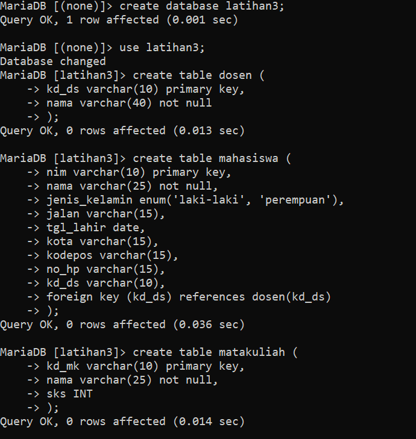
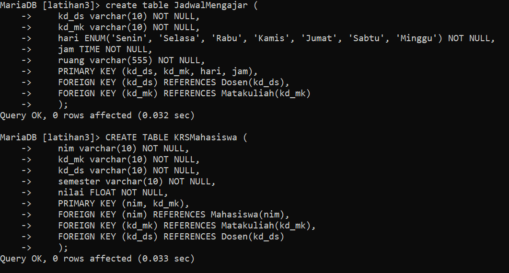
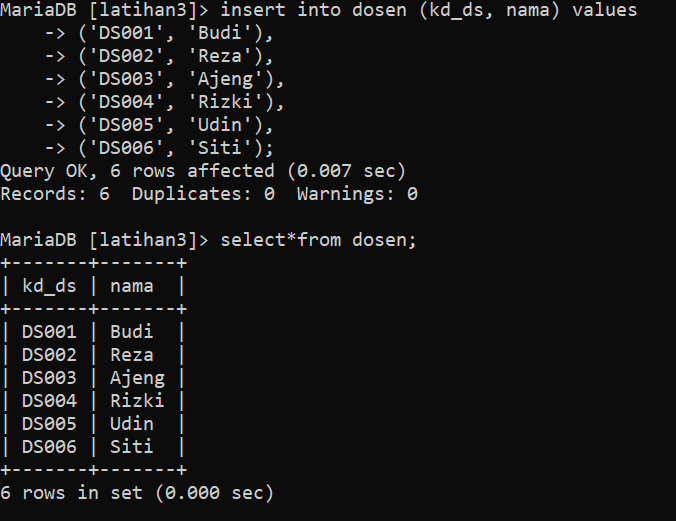
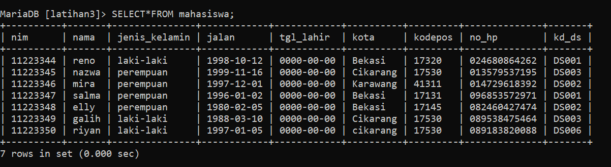
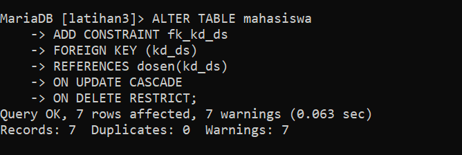
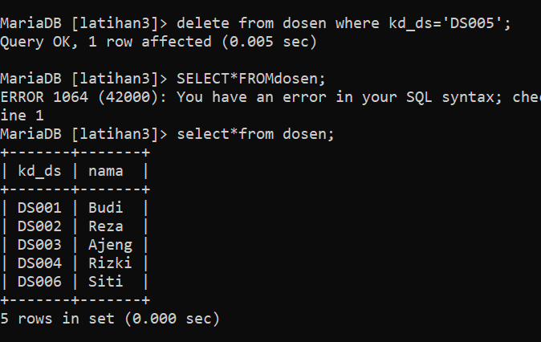
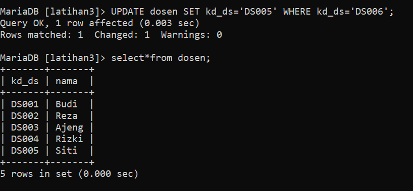
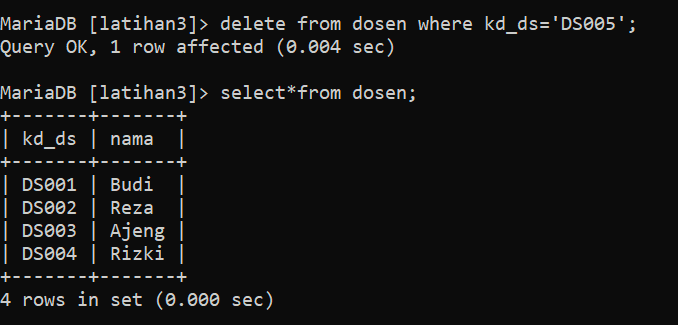
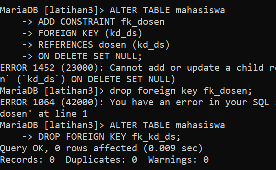
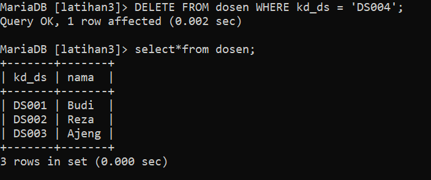

# Tugas Praktikum 3 { Pertemuan ke 10 } 
|**Nama**|**NIM**|**Kelas**|**Matkul**|
|----|---|-----|------|
|Gladis Toti Anggraini |312310566|TI.23.A5|Basis Data|

# Soal Latihan Praktikum 3
## Tulis semua perintah-perintah SQL percobaan di atas beserta outputnya!
### Implementasi penggunaan CONSTRAINT FOREIGN KEY pada semua tabel yang berelasi.

**Constraint FOREIGN KEY** adalah aturan yang digunakan untuk memastikan bahwa nilai pada kolom yang berelasi dengan tabel lainnya harus ada pada tabel lainnya tersebut. Pada contoh di atas, constraint FOREIGN KEY digunakan untuk memastikan bahwa nilai pada kolom kd_ds pada tabel mahasiswa harus ada pada kolom kd_ds pada tabel dosen.

### Langkah-langkahnya :

**Buat sebuah script untuk tabel dosen, mahasiswa, matakuliah, jadwal mengajar, dan krs mahasiswa**

**1. Lakukan penambahan data pada table mahasiswa dengan mengisi kd_ds yangbelum ada pada data dosen.**

- **INSERT INTO** Perintah ini digunakan untuk menambahkan baris data baru ke dalam tabel. 
- Perintah **SELECT * FROM** digunakan untuk melakukan query data dari tabel yang besar dan memiliki banyak kolom. Perintah akan mengambil semua data dari tabel mahasiswa, yang berarti akan mengambil semua kolom dan semua baris dari tabel tersebut.

**2. Hapus satu record data pada table dosen yang telah dirujuk pada tabelmahasiswa.**

**3. Ubah mode menjadi ON UPDATE CASCADE ON DELETE RESTRICT**

- **DELETE FROM** perintah ini digunakan untuk menghapus satu atau lebih baris dari sebuah tabel. Dalam konteks tugas ini, digunakan untuk menghapus satu record data pada tabel dosen berdasarkan pada kd_ds tertentu.
- Menghapus satu record data pada tabel dosen yang telah dirujuk pada tabel mahasiswa dapat dilakukan dengan menggunakan perintah **DELETE** di tabel dosen. Namun, sebelum menghapus data pada tabel dosen, pastikan sudah ada konfigurasi **ON DELETE RESTRICT** pada foreign key yang ada pada tabel mahasiswa. Fungsinya adalah untuk mencegah penghapusan data pada tabel dosen yang masih digunakan oleh tabel mahasiswa.

**4. Lakukan perubahan data pada table dosen (kd_ds)**

**UPDATE** perintah ini digunakan untuk memperbarui nilai kolom dalam baris yang sudah ada dalam tabel. 

**5. Lakukan penghapusan data pada table dosen**

**6. Ubah mode menjadi ON UPDATE CASCADE ON DELETE SET NULL**

Mengubah mode **constraint FOREIGN KEY** menjadi **ON UPDATE CASCADE ON DELETE SET NULL** . Artinya, jika mengupdate nilai pada kolom kd_ds pada tabel dosen, maka nilai pada kolom kd_ds pada tabel mahasiswa juga akan diupdate. Jika menghapus data pada tabel dosen, maka nilai pada kolom kd_ds pada tabel mahasiswa akan di-set menjadi NULL.

**7. Lakukan penghapusan data pada table dosen**

### Evaluasi
- **ON DELETE RESTRICT** digunakan untuk mencegah penghapusan baris dalam tabel induk (tabel dosen dalam contoh ini) jika ada baris yang masih dirujuk oleh kunci asing di tabel anak (tabel mahasiswa).
- **ON UPDATE CASCADE** menyebabkan nilai kunci asing di tabel yang terkait juga diperbarui ketika nilai kunci utama diubah.
- **Kesimpulannya**, penggunaan **RESTRICT** digunakan untuk mencegah kehilangan data yang masih diperlukan, sedangkan penggunaan **CASCADE** digunakan untuk mengupdate atau menghapus data secara otomatis pada tabel anak jika terjadi perubahan pada tabel induk. Pilihan antara RESTRICT dan CASCADE tergantung pada kebutuhan aplikasi dan situasi tertentu.
- https://docs.google.com/document/d/11L-h8RqNV6j-3EtB7-v4c5UPaMVr24sXCOG3ajcsGKY/edit?usp=sharing

### Sekian Tugas Praktikum Saya di Pertemuan kali ini. 

### Jika Masih Ada Yang Salah Saya Mohon Maaf.

### Wassalamualaikum wr.wb. 
